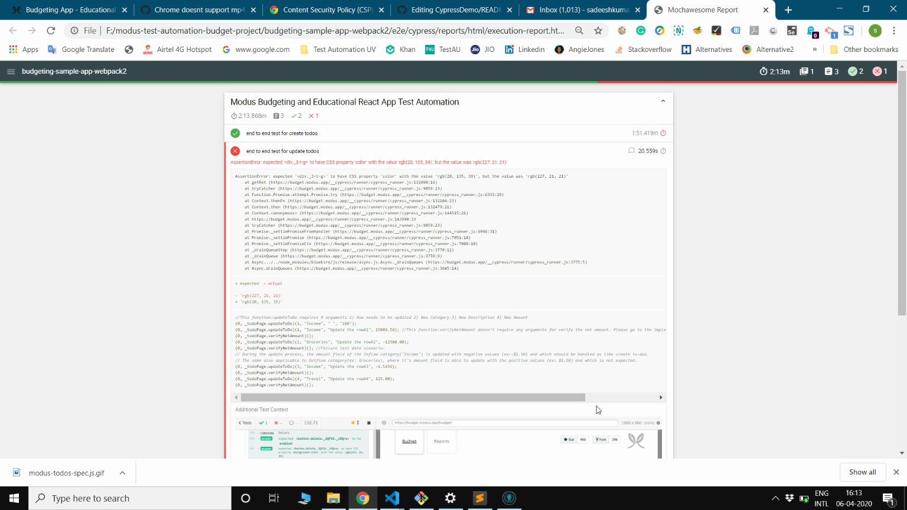

# Modus Create - Test Automation Assignment

## Requirement 1
Write a test plan for this [budget management application](https://budget.modus.app). This plan should include appropriate test coverage with both negative and positive test scenarios. 

+ Please find the [Test Plan here](.../Test_Plan_for_Modus_budget_management_application.xls) 

## Requirement 2 & 3: 
  1. Select **3** test scenarios from your test plan to automate and be sure to include appropriate directions for execution
  2. Text execution should spin up a Chrome browser and include at least one scenario that fails

#### End to End test Scenarios considered for automation:
  1. **Create to-dos:**
   + Verify user can able to create to-dos with various data combinations
   + Verify all the given data are inserted as expected
   + Verify the total inflow, outflow and balancing amounts are populated as expected
  2. **Update to-dos:**
   * Verify user can able to update any to-dos with various data combinations
   * Verify all the given data are updated in the table as expected
   * Verify the total inflow, outflow and balancing amounts are populated as expected    
   **_Notes_**: 
        + This test scenario would get FAIL since during the update process, the **amount field of the Inflow category type("Income") is
          **updated with negative values (ex:-$1.50)** and which has to be positive number "$1.50". 
          This logic should be handled as similar to creating to-dos.
        + The same also applicable to **Outflow category types(ex: Groceries)**, where it's amount field is able to **update with                  positive values (ex: $1.50)** and which has to be "-$1.50".
  3. **delete to-dos:**
   + Verify user can able to delete any to-dos
   + Verify the chosen record is successfully deleted from the table
   + Verify the total inflow, outflow and balancing amounts are populated as expected
   
### NPM Scripts for test execution
   + **npm install** - install dependencies
   + **npm run e2e:chrome** - spin up the test execution in chrome browser
      **_Notes_**: 
       +  Cypress automatically detects available browsers on your OS and launch that up, so this may take some seconds to begin the execution at first run.
       + If Chrome browser is not installed in your system, please install it first and proceed this script.
       + Also, we can launch any supported browser by specifying a path to the binary like this: cypress run --browser /usr/bin/chromium
       + Please refer this [Cypress documentation page](https://docs.cypress.io/guides/guides/launching-browsers.html) for more detail
   + **npm run e2e:chrome-headless** -> spin up the test execution in headless chrome browser
   + **npm run e2e:firefox** -> spin up the test execution in firefox browser
   + **npm run e2e:edge** -> spin up the test execution in chromium based edge browser
   + **npm run e2e:electron** -> spin up the test execution in headless electron browser 
       + The Electron browser is a version of Chromium that comes with Electron and this has the advantage of coming baked into 
         Cypress and does not need to be installed separately.
   + **npm run e2e:local:chrome** -> switch the test execution to local server 
       + Before this script, execute "npm start" to host the app in local server(i.e, port:3000 in our case)
   + **npm run pree2e:chrome** -> this script will be run automatically before every execution of our intended script **npm run e2e:chrome**
       + Why it is required: Before generating HTML report for the current test run which would spin-up in chrome browser for our case, 
         so it is good to remove existing screenshots, results, and reports from their respective storage places.
       + For other browsers execution(firefox, edge, electron), this script needs to be executed manually.
   + **npm run report** -> Helps to generate the HTML report using mochawesome reporter
   + **npm run cy:open** -> Helps to perform the test execution with Cypress test runner by pointing to this [production URL](https://budget.modus.app)
   + **npm run cy:open:local** -> Helps to perform the execution with Cypress test runner by pointing to the local server(i.e, port:3000 in our case)

## Bonus Points
  * - [ ] Incorporate Cucumber into your tests
  * - [x] Include the ability to generate an HTML report of the test results.
      
  * - [x] Organize test execution depending on the test framework chosen
      + Cypress will automatically scaffold out a suggested folder structure and please look at ../e2e/cypress/
  * - [x] Use a design pattern to structure your tests
      + Note: Used Page Object Design Pattern(POM)
      + Test file: modus-todos-spec.js
      + Page Objects: todo-page.js
      + Configurations: cypress.json,reporters-config.json,tsconfig.json
* - [x] Multi browser support is a plus
      + Cypress currently supports Firefox and Chrome-family browsers (including Edge and Electron). Please refer this [Cypress documentation page](https://docs.cypress.io/guides/guides/launching-browsers.html) for the supported browsers from Cypress.
      + Added NPM scripts for electron, chrome, chrome-headless, firefox, edge
